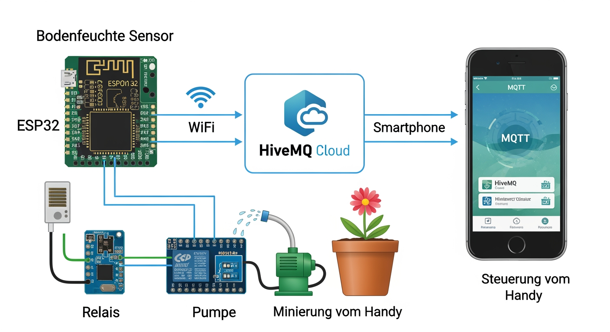

# 🌺 ESP32 MQTT Blumenbewässerung



Ferngesteuerte Blumenbewässerung über MQTT und HiveMQ Cloud.  
Steuerung von überall auf der Welt möglich (z.B. von Malta 🇲🇹 nach Deutschland 🇩🇪).

---

## 📋 Projektübersicht

```
🌱 Blumentopf
      │
      ▼
🔴 Soil Moisture Sensor  → Bodenfeuchte messen
      │
      ▼
🔵 ESP32 WROOM 32        → Verarbeitung & WiFi
      │
      ▼
☁️  HiveMQ Cloud         → MQTT Broker
      │
      ▼
📱 EasyMQTT App          → Steuerung vom Handy
      │
      ▼
💧 Relais + Pumpe        → Blume gießen
```

---

## 🛠️ Hardware

| Komponente | Beschreibung |
|---|---|
| ESP32 WROOM 32 (AZ-Delivery) | Mikrocontroller mit WiFi |
| Soil Moisture Sensor | Bodenfeuchte messen |
| Relais Modul SRD-05VDC-SL-C | Pumpe schalten |
| Mini Wasserpumpe 3V DC | Wasser pumpen |
| PCA9685 PWM Board | 16 Kanal Servo Controller |
| Servo Motor MG996R | Optionale Steuerung |
| Regen/Wasser Sensor | Wasserstand messen |

---

## 📁 Projektstruktur

```
ESP32_MQTT_Sensor/
│
├── 📄 README.md
├── 📄 platformio.ini
├── 📁 bilder/
│   └── 🖼️  bild.png
└── 📁 src/
    ├── 📄 main.cpp          ← Hauptprogramm
    ├── 📄 config.h          ← Alle Einstellungen
    ├── 📄 wifi_manager.h    ← WiFi Header
    ├── 📄 wifi_manager.cpp  ← WiFi Verbindung
    ├── 📄 mqtt_manager.h    ← MQTT Header
    └── 📄 mqtt_manager.cpp  ← MQTT Senden & Empfangen
```

---

## ⚙️ Konfiguration

Alle Einstellungen in `src/config.h` anpassen:

```cpp
// WiFi
#define WIFI_SSID       "DEIN_WIFI_NAME"
#define WIFI_PASSWORD   "DEIN_WIFI_PASSWORT"

// HiveMQ Cloud
#define MQTT_HOST       "xxxxx.s1.eu.hivemq.cloud"
#define MQTT_PORT       8883
#define MQTT_USER       "DEIN_USERNAME"
#define MQTT_PASSWORD   "DEIN_PASSWORT"

// Pins
#define RELAY_PIN       26    // Relais → Pumpe
#define LED_PIN         4     // Test LED
#define SOIL_PIN        34    // Bodenfeuchte Sensor
```

---

## 📡 MQTT Topics

| Topic | Richtung | Nachricht | Beschreibung |
|---|---|---|---|
| `home/esp32/status` | ESP32 → App | `ESP32 laeuft!` | Status ESP32 |
| `home/esp32/ip` | ESP32 → App | `192.168.x.x` | IP Adresse |
| `home/esp32/rssi` | ESP32 → App | `-72 dBm` | WiFi Signal |
| `home/system/uptime` | ESP32 → App | `120 Sekunden` | Laufzeit |
| `home/led/command` | App → ESP32 | `HIGH` / `LOW` | LED steuern |
| `home/led/status` | ESP32 → App | `LED ist AN` | LED Status |
| `home/pump/command` | App → ESP32 | `ON` / `OFF` | Pumpe steuern |
| `home/pump/status` | ESP32 → App | `Pumpe ist AN` | Pumpen Status |
| `home/sensor/soil` | ESP32 → App | `0-100%` | Bodenfeuchte |
| `home/sensor/water_level` | ESP32 → App | Wert | Wasserstand |
| `home/system/error` | ESP32 → App | Fehlermeldung | Fehler |

---

## 🔌 Pin Belegung ESP32

```
ESP32 Board (AZ-Delivery)
┌─────────────────────────────────┐
│  Linke Seite    Rechte Seite    │
│                                 │
│  3.3V           GND             │
│  EN             GPIO 23         │
│  GPIO 34        GPIO 22         │
│  GPIO 25        TX (GPIO 1)     │
│  GPIO 32        RX (GPIO 3)     │
│  GPIO 33        GPIO 21         │
│  GPIO 25        GND             │
│  GPIO 26 ←Relais GPIO 19        │
│  GPIO 27        GPIO 18         │
│  GPIO 14        GPIO 5          │
│  GPIO 12        GPIO 17         │
│  GND            GPIO 16         │
│  GPIO 13        GPIO 4  ←LED    │
│  GPIO 2 (LED)   GPIO 0          │
│  GPIO 3         GPIO 2          │
│  5V             GPIO 15         │
│        [ USB ]                  │
└─────────────────────────────────┘
```

---

## 🔌 Anschlussplan Relais & Pumpe

```
ESP32              Relais Modul
─────────          ────────────
3.3V    ──────────► VCC
GND     ──────────► GND
GPIO 26 ──────────► IN

Relais Modul       Pumpe & Netzteil
────────────       ────────────────
COM     ──────────► + Pumpe (rot)
NO      ──────────► + 5V Netzteil

GND Netzteil ─────► - Pumpe (schwarz)
```

---

## ☁️ HiveMQ Cloud Setup

1. Account erstellen auf [hivemq.com](https://www.hivemq.com)
2. Kostenlosen Cluster erstellen (Free Plan)
3. Credentials erstellen (Username & Passwort)
4. Daten in `config.h` eintragen

---

## 📱 App Setup (EasyMQTT)

```
Host:      xxxxx.s1.eu.hivemq.cloud
Port:      8883
Username:  Dein HiveMQ Username
Passwort:  Dein HiveMQ Passwort
TLS/SSL:   AN ✅
Client-ID: myHome_iPhone_001
```

---

## 🚀 Installation

```bash
# Repository klonen
git clone https://github.com/Taleb93/MQTT-Server.git

# In PlatformIO öffnen
# config.h anpassen
# Build & Upload
pio run --target upload

# Serial Monitor
pio device monitor
```

---

## 📦 Bibliotheken

```ini
lib_deps =
    knolleary/PubSubClient @ ^2.8
    bblanchon/ArduinoJson @ ^6.21.3
```

---

## 🌍 System Übersicht

```
🇩🇪 Deutschland              🇲🇹 Malta
─────────────                ──────────
ESP32 + Sensor               Du (unterwegs)
      │                            │
      │ WiFi                       │ 4G/WiFi
      ▼                            ▼
   Router ──── Internet ──── HiveMQ Cloud
                                   │
                              EasyMQTT App
```

---

## 👤 Autor

- **GitHub:** [Taleb93](https://github.com/Taleb93)
- **Repository:** [MQTT-Server](https://github.com/Taleb93/MQTT-Server)

---

## 📄 Lizenz

MIT License - Kostenlos nutzbar
